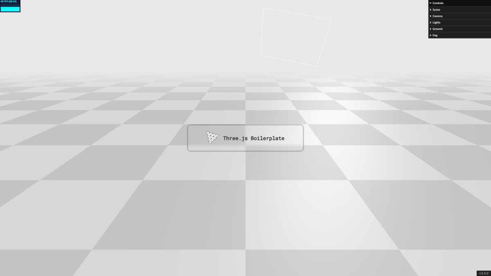

# [Three.js Boilerplate](https://ustymukhman.github.io/threejs-boilerplate/dist) #

*Three.js + TypeScript + Svelte + Jest + Vite*

## Download ##

`git clone https://github.com/UstymUkhman/threejs-boilerplate.git`

`cd threejs-boilerplate`

## Develop ##

`yarn`

`yarn start`

## Lint ##

`yarn lint:js`

`yarn lint:css`

## Test ##

`yarn test`

`yarn test:watch`

`yarn test:cover`

`yarn test:clear`

## Build ##

`yarn build`

`yarn serve`
