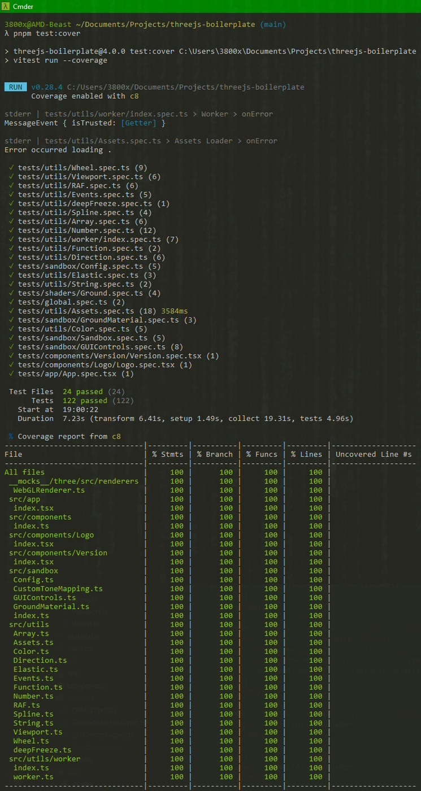

# Three.js Boilerplate #

🔥 [Three.js](https://threejs.org/) + [TypeScript](https://www.typescriptlang.org/) + [SolidJS](https://www.solidjs.com/) + [Vite](https://vitejs.dev/) + [Vitest](https://vitest.dev/) 🚀

> Minimal, yet complete template for developing three.js projects.


[](https://ustymukhman.github.io/threejs-boilerplate/dist)

## 📂 Structure ##

```
Three.js Boilerplate
├── __mocks__/
├── coverage/
├── dist/
├── node_modules/
├── public/
│   ├── assets/
│   ├── favicons/
│   ├── scripts/
│   ├── styles/
│   ├── browserconfig.xml
│   ├── manifest.json
│   ├── robots.txt
│   └── sitemap.xml
├── src/
│   ├── app/
│   ├── assets/
│   ├── components/
│   ├── sandbox/
│   ├── scss/
│   ├── shaders/
│   ├── utils/
│   ├── global.d.ts
│   └── main.tsx
├── tests/
│   ├── app/
│   ├── components/
│   ├── sandbox/
│   ├── shaders/
│   ├── utils/
│   ├── canvas.mock.d.ts
│   ├── canvas.mock.ts
│   └── global.spec.ts
├── index.html
├── package.json
├── tsconfig.json
├── vite.config.ts
└── vitest.config.ts
```

<details>
  <summary>
    <h2 style="display: inline-block;">🔌 Usage</h2>
  </summary>
  &emsp;&ensp;Simply click <b>Use this template</b> and <b>Create a new repository</b>.
  <br />
  &emsp;&ensp;This will initialize your own repository from this boilerplate.
</details>

<details>
  <summary>
    <h2 style="display: inline-block;">✨ Features</h2>
  </summary>
  <h3>&emsp;&emsp;&ensp;⚙️ Basic</h3>
  &emsp;&emsp;&emsp;&emsp;&emsp;&nbsp;&bull; Cross-platform <a href="./public/favicons" target="_blank">Favicons</a><br />
  &emsp;&emsp;&emsp;&emsp;&emsp;&nbsp;&bull; Meta tags for sharing on <a href="./index.html#L29-L34" target="_blank">Facebook</a> and <a href="./index.html#L36-L40" target="_blank">Twitter</a><br />
  &emsp;&emsp;&emsp;&emsp;&emsp;&nbsp;&bull; <a href="./index.html#L78-L84" target="_blank">Unsupported browser</a> and <a href="./index.html#L86-L94" target="_blank">disabled JavaScript</a> screens

  <h3>&emsp;&emsp;&ensp;🧩 Components</h3>
  &emsp;&emsp;&emsp;&emsp;&emsp;&nbsp;&bull; <a href="./src/app/index.tsx" target="_blank">Application</a> entry point<br />
  &emsp;&emsp;&emsp;&emsp;&emsp;&nbsp;&bull; <a href="./src/components/Logo/index.tsx" target="_blank">Logo</a> label component<br />
  &emsp;&emsp;&emsp;&emsp;&emsp;&nbsp;&bull; Current <a href="./src/components/Version/index.tsx" target="_blank">version</a> tag

  <h3>&emsp;&emsp;&ensp;🏝️ Sandbox</h3>
  &emsp;&emsp;&emsp;&emsp;&emsp;&nbsp;&bull; Simple three.js <a href="./src/sandbox/index.ts" target="_blank">scene</a> with:

  &emsp;&emsp;&emsp;&emsp;&emsp;&emsp;&nbsp;&#9702; Linear Fog<br />
  &emsp;&emsp;&emsp;&emsp;&emsp;&emsp;&nbsp;&#9702; Ground Plane<br />
  &emsp;&emsp;&emsp;&emsp;&emsp;&emsp;&nbsp;&#9702; Orbit Controls<br />
  &emsp;&emsp;&emsp;&emsp;&emsp;&emsp;&nbsp;&#9702; Stats Monitoring<br />
  &emsp;&emsp;&emsp;&emsp;&emsp;&emsp;&nbsp;&#9702; Perspective Camera<br />
  &emsp;&emsp;&emsp;&emsp;&emsp;&emsp;&nbsp;&#9702; Default WebGL2 Renderer<br />
  &emsp;&emsp;&emsp;&emsp;&emsp;&emsp;&nbsp;&#9702; Ambient & Directional Lighting

  &emsp;&emsp;&emsp;&emsp;&emsp;&nbsp;&bull; Scene <a href="./src/sandbox/Config.ts" target="_blank">configuration</a> file with initial parameter values.<br />
  &emsp;&emsp;&emsp;&emsp;&emsp;&nbsp;&bull; Custom checkerboard-like ground plane <a href="./src/sandbox/GroundMaterial.ts" target="_blank">material</a>.<br />
  &emsp;&emsp;&emsp;&emsp;&emsp;&nbsp;&bull; GUI <a href="./src/sandbox/GUIControls.ts" target="_blank">controls</a> built on top of <code>lil-gui</code>.<br />
  &emsp;&emsp;&emsp;&emsp;&emsp;&nbsp;&bull; **Uncharted 2** <a href="./src/sandbox/CustomToneMapping.ts" target="_blank">tone mapping</a> shader.

  <h3>&emsp;&emsp;&ensp;🎨 Shaders</h3>
  &emsp;&emsp;&emsp;&emsp;&emsp;&nbsp;&bull; Custom shader support through <a href="https://github.com/UstymUkhman/vite-plugin-glsl" target="_blank">vite-plugin-glsl</a>.<br />
  &emsp;&emsp;&emsp;&emsp;&emsp;&nbsp;&bull; Three.js shaders for <a href="./src/shaders/ground" target="_blank">ground</a> plane material.<br />
  &emsp;&emsp;&emsp;&emsp;&emsp;&nbsp;&bull; Three.js shaders for custom <a href="./src/shaders/mapping" target="_blank">tone mapping</a>.

  <h3>&emsp;&emsp;&ensp;🛠️ Utilities</h3>
  &emsp;&emsp;&emsp;&emsp;&emsp;&nbsp;&bull; <a href="./src/utils/Assets.ts" target="_blank">Assets</a> loading manager:

  &emsp;&emsp;&emsp;&emsp;&emsp;&emsp;&nbsp;&#9702; Promise based APIs<br />
  &emsp;&emsp;&emsp;&emsp;&emsp;&emsp;&nbsp;&#9702; Loading errors logging<br />
  &emsp;&emsp;&emsp;&emsp;&emsp;&emsp;&nbsp;&#9702; Start, Progress & Complete loading events<br />
  &emsp;&emsp;&emsp;&emsp;&emsp;&emsp;&nbsp;&#9702; <code>usePublicFolder</code> option for setting assets path<br />
  &emsp;&emsp;&emsp;&emsp;&emsp;&emsp;&nbsp;&#9702; Audio, GLTF/GLB, CubeTexture & Texture loaders

  &emsp;&emsp;&emsp;&emsp;&emsp;&nbsp;&bull; <a href="./src/utils/Array.ts" target="_blank">Array</a>, <a href="./src/utils/Color.ts" target="_blank">Color</a>, <a href="./src/utils/Number.ts" target="_blank">Number</a>, <a href="./src/utils/String.ts" target="_blank">String</a> & <code><a href="./src/utils/deepFreeze.ts" target="_blank">deepFreeze</a></code> methods.<br />
  &emsp;&emsp;&emsp;&emsp;&emsp;&nbsp;&bull; <a href="./src/utils/Elastic.ts" target="_blank">Elastic</a> Number, Vector3 and Vector3 classes.<br />
  &emsp;&emsp;&emsp;&emsp;&emsp;&nbsp;&bull; Custom <a href="./src/utils/Events.ts" target="_blank">Events</a> and EventEmitter manager.<br />
  &emsp;&emsp;&emsp;&emsp;&emsp;&nbsp;&bull; Mouse <a href="./src/utils/Wheel.ts" target="_blank">Wheel</a> normalization function.<br />
  &emsp;&emsp;&emsp;&emsp;&emsp;&nbsp;&bull; <code>debounce</code> and <code>throttle</code> <a href="./src/utils/Function.ts" target="_blank">function</a>s.<br />
  &emsp;&emsp;&emsp;&emsp;&emsp;&nbsp;&bull; <code><a href="./src/utils/RAF.ts" target="_blank">requestAnimationFrame</a></code> manager.<br />
  &emsp;&emsp;&emsp;&emsp;&emsp;&nbsp;&bull; Custom Web <a href="./src/utils/worker" target="_blank">Worker</a> manager.<br />
  &emsp;&emsp;&emsp;&emsp;&emsp;&nbsp;&bull; <a href="https://unity.com/" target="_blank">Unity</a>-like <code>Vector3</code> <a href="./src/utils/Direction.ts" target="_blank">direction</a>s.<br />
  &emsp;&emsp;&emsp;&emsp;&emsp;&nbsp;&bull; <a href="./src/utils/Spline.ts" target="_blank">Spline</a> interpolation manager.<br />
  &emsp;&emsp;&emsp;&emsp;&emsp;&nbsp;&bull; Screen <a href="./src/utils/Viewport.ts" target="_blank">Viewport</a> manager.

  <h3>&emsp;&emsp;&ensp;🧰 Miscellaneous</h3>
  &emsp;&emsp;&emsp;&emsp;&emsp;&nbsp;&bull; Scoped <a href="https://sass-lang.com/" target="_blank">SCSS</a> and common <a href="./src/scss/easings.scss" target="_blank">easing</a> functions.<br />
  &emsp;&emsp;&emsp;&emsp;&emsp;&nbsp;&bull; Support for common 3D <a href="./vite.config.ts#L9" target="_blank">formats</a>.<br />
  &emsp;&emsp;&emsp;&emsp;&emsp;&nbsp;&bull; Common <a href="./src/assets" target="_blank">assets</a> folders.<br />
  &emsp;&emsp;&emsp;&emsp;&emsp;&nbsp;&bull; <a href="https://web.dev/progressive-web-apps/" target="_blank">PWA</a>-ready <a href="./public/manifest.json" target="_blank">manifest</a>.<br />
  &emsp;&emsp;&emsp;&emsp;&emsp;&nbsp;&bull; <a href="./LICENSE" target="_blank">MIT</a> license.

  <h3>&emsp;&emsp;&ensp;📦 Package Manager</h3>
  &emsp;&emsp;&emsp;&emsp;&emsp;&nbsp;This project was build with <code><a href="https://pnpm.io/" target="_blank">pnpm</a></code>, but <code><a href="https://yarnpkg.com/" target="_blank">yarn</a></code> and <code><a href="https://www.npmjs.com/" target="_blank">npm</a></code> are also supported.<br />
  &emsp;&emsp;&emsp;&emsp;&emsp;&nbsp;Just replace <code>pnpm</code> in all commands below with <code>yarn</code> or <code>npm run</code>.<br />
  &emsp;&emsp;&emsp;&emsp;&emsp;&nbsp;For <code>npm</code> users, one exception is the installation, where it's <code>npm i</code>.

  <h3>&emsp;&emsp;&ensp;📈 Tests Coverage</h3>
  &emsp;&emsp;&emsp;&emsp;&emsp;&nbsp;All the code in the <code>src/</code> directory has been fully tested and has a <b>100%</b> code coverage.<br />
  <details>
    <summary>
      &emsp;&emsp;&emsp;&emsp;&nbsp;<b>Show me some numbers!</b><br /><br />
    </summary>
    &emsp;&emsp;&emsp;&emsp;&emsp;&nbsp;
  </details>
</details>

<details>
  <summary>
    <h2 style="display: inline-block;">💾 Download</h2>
  </summary>
  &emsp;&ensp;<code>git clone https://github.com/UstymUkhman/threejs-boilerplate.git</code>
  <br />
  &emsp;&ensp;<code>cd threejs-boilerplate</code>
</details>

<details>
  <summary>
    <h2 style="display: inline-block;">⌨️ Develop</h2>
  </summary>
  &emsp;&ensp;<code>pnpm i</code>
  <br />
  &emsp;&ensp;<code>pnpm start</code>
</details>

<details>
  <summary>
    <h2 style="display: inline-block;">✔️ Lint</h2>
  </summary>
  &emsp;&ensp;<code>pnpm lint:js</code>
  <br />
  &emsp;&ensp;<code>pnpm lint:css</code>
</details>

<details>
  <summary>
    <h2 style="display: inline-block;">🧪 Test</h2>
  </summary>
  &emsp;&ensp;<code>pnpm test</code>
    <br />
  &emsp;&ensp;<code>pnpm test:watch</code>
    <br />
  &emsp;&ensp;<code>pnpm test:cover</code>
</details>

<details>
  <summary>
    <h2 style="display: inline-block;">🧱 Build</h2>
  </summary>
  &emsp;&ensp;<code>pnpm build</code>
  <br />
  &emsp;&ensp;<code>pnpm serve</code>
</details>
