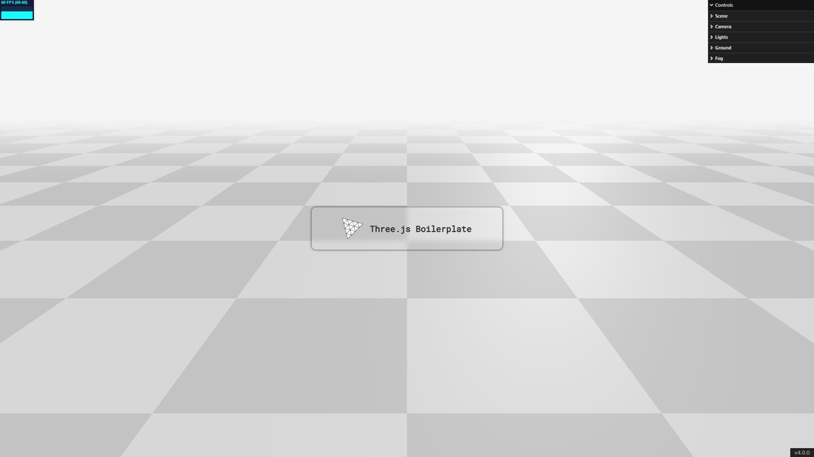

# Three.js Boilerplate #

🔥 [Three.js](https://threejs.org/) + [TypeScript](https://www.typescriptlang.org/) + [SolidJS](https://www.solidjs.com/) + [Vite](https://vitejs.dev/) + [Vitest](https://vitest.dev/) 🚀

> Minimal, yet complete template for developing three.js projects.


[](https://ustymukhman.github.io/threejs-boilerplate/dist)

## 📂 Structure ##

```
Three.js Boilerplate
├── __mocks__/
├── coverage/
├── dist/
├── node_modules/
├── public/
│   ├── assets/
│   ├── favicons/
│   ├── scripts/
│   ├── styles/
│   ├── browserconfig.xml
│   ├── manifest.json
│   ├── robots.txt
│   └── sitemap.xml
├── src/
│   ├── app/
│   ├── assets/
│   ├── components/
│   ├── sandbox/
│   ├── scss/
│   ├── shaders/
│   ├── utils/
│   ├── global.d.ts
│   └── main.tsx
├── tests/
│   ├── app/
│   ├── components/
│   ├── sandbox/
│   ├── shaders/
│   ├── utils/
│   ├── canvas.mock.d.ts
│   ├── canvas.mock.ts
│   └── global.spec.ts
├── index.html
├── package.json
├── tsconfig.json
├── vite.config.ts
└── vitest.config.ts
```

<details>
  <summary>
    <h2 style="display: inline-block;">🔌 Usage</h2>
  </summary>
  &emsp;&ensp;Simply click <b>Use this template</b> and <b>Create a new repository</b>.
  <br />
  &emsp;&ensp;This will initialize your own repository from this boilerplate.
</details>

<details>
  <summary>
    <h2 style="display: inline-block;">💾 Download</h2>
  </summary>
  &emsp;&ensp;<code>git clone https://github.com/UstymUkhman/threejs-boilerplate.git</code>
  <br />
  &emsp;&ensp;<code>cd threejs-boilerplate</code>
</details>

<details>
  <summary>
    <h2 style="display: inline-block;">⌨️ Develop</h2>
  </summary>
  &emsp;&ensp;<code>pnpm i</code>
  <br />
  &emsp;&ensp;<code>pnpm start</code>
</details>

<details>
  <summary>
    <h2 style="display: inline-block;">✔️ Lint</h2>
  </summary>
  &emsp;&ensp;<code>pnpm lint:js</code>
  <br />
  &emsp;&ensp;<code>pnpm lint:css</code>
</details>

<details>
  <summary>
    <h2 style="display: inline-block;">🧪 Test</h2>
  </summary>
  &emsp;&ensp;<code>pnpm test</code>
    <br />
  &emsp;&ensp;<code>pnpm test:watch</code>
    <br />
  &emsp;&ensp;<code>pnpm test:cover</code>
</details>

<details>
  <summary>
    <h2 style="display: inline-block;">🧱 Build</h2>
  </summary>
  &emsp;&ensp;<code>pnpm build</code>
  <br />
  &emsp;&ensp;<code>pnpm serve</code>
</details>
